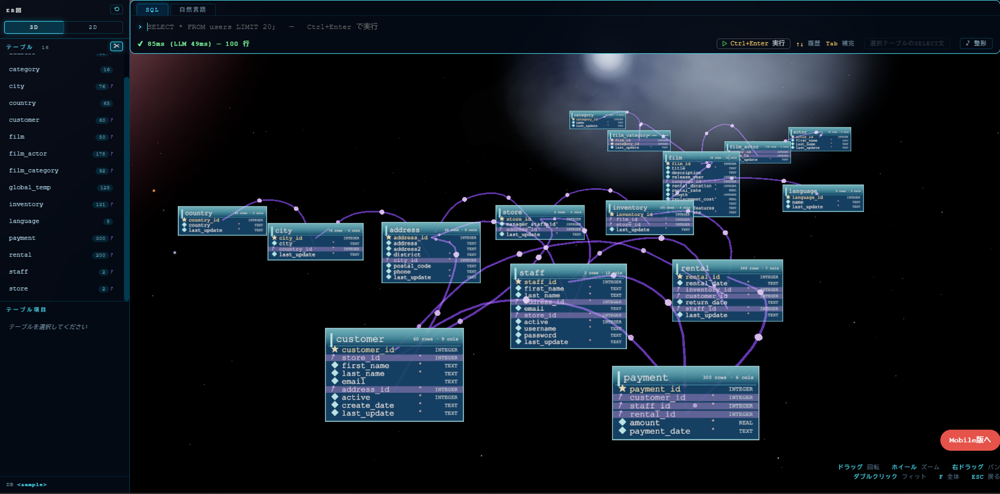
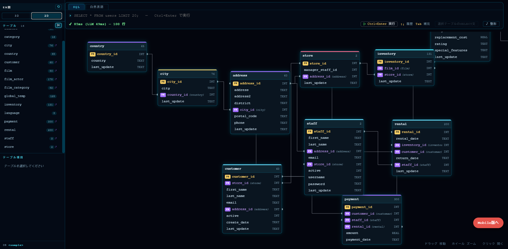
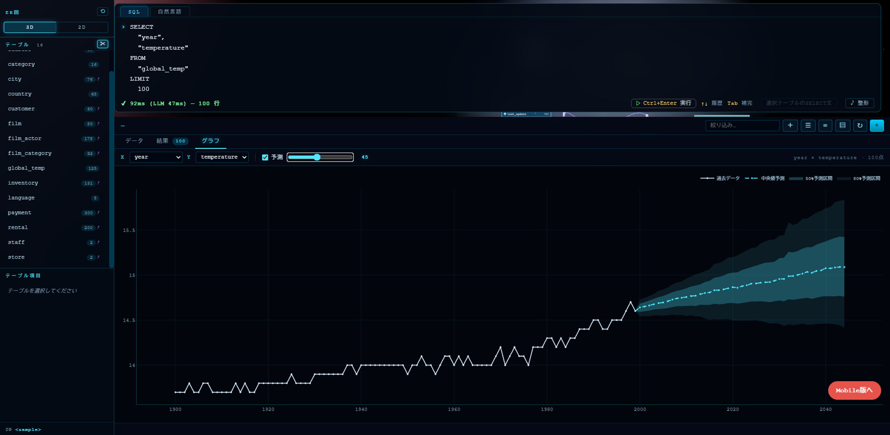

# DBVERSE

3D ER図 + Text-to-SQL のデータベースクライアント。

デモ: https://dbverse.vlabos.com/
デモのLLMはARM 2コアのCPU + Gemma E2B なので、自然言語は雰囲気程度です。
DBは3時間おきにリセットされます。

スキーマを3D空間に浮かぶカードとして可視化し、自然言語でSQLを生成・実行できるDBツールです。

## 主な機能

- **3D ER図** — テーブルを立体的に表示。リレーション線をリアルタイムで描画
- **2D ER図** — 平面レイアウト。カードをドラッグで移動でき、配置はサーバーに保存される

  

- **Text-to-SQL** — 自然言語で質問すると、LLMがSQLを生成して自動実行
- **ストリーミング表示** — 生成中のSQLをSSEでリアルタイム表示
- **データビュー** — テーブルの中身を表示・編集・エクスポート
- **CRUD操作** — 行の追加・編集・削除に対応
- **ドラッグ&ドロップ** — テーブル名・カラム名をSQLバーに挿入
- **時系列予測** — SQLの結果をそのままグラフタブに送ると、Chronosによる予測（信頼区間つき）を表示

  

## 必要なもの

- Python 3.10+
- （PostgreSQLを使う場合）PostgreSQL サーバー
- （Text-to-SQLを使う場合）OpenAI互換APIのLLM
  - ローカル: llama-server, Ollama, vLLM, LM Studio
  - クラウド: OpenAI, Gemini, Anthropic, Groq, OpenRouter 等
- （時系列予測を使う場合）`chronos-service.py` を別プロセスで起動

## セットアップ

    git clone https://github.com/KojiOzono/dbverse.git
    cd dbverse
    python3 -m venv venv
    source venv/bin/activate

    # CPU版 torch を先に入れる（CUDA版を避けるため）
    pip install torch --index-url https://download.pytorch.org/whl/cpu

    pip install -r requirements.txt
    cp config.sample.py config.py

### DBVERSE 本体を起動

    python server.py

ブラウザで http://localhost:8888 を開く。

### 時系列予測（chronos-service）を起動

別のターミナルで:

    python chronos-service.py

または systemd 経由:

    sudo systemctl start chronos-service

`config.py` でDB接続とLLMを設定できる。デフォルトはSQLite（サンプルデータ付き）で、そのまま起動すれば試せる。

## 使い方

- **ER図** — サイドバーでテーブルを選択。3D / 2D 切替可能
- **自然言語でSQL** — 「自然言語」タブで質問すると、LLMがSQLを生成して実行
- **データ編集** — セルをダブルクリックで編集、行を選択して削除
- **時系列予測** — SQLの結果が出たら「グラフ」タブに切り替え、「予測」にチェック。
  1列目（日付）をX軸、2列目（数値）をY軸として自動認識し、Chronosが未来を予測する。

### 予測のコツ

- **週次・月次に丸める**と予測精度が上がる（日次はノイズが多く平坦な予測になる）
- 時系列データ（`week`, `month` など）を1列目に置くこと
- カテゴリ×数値は「時系列ではない」と判定され、予測は使えない

例:

    SELECT
      to_char(date_trunc('week', created_at), 'YYYY-MM-DD') AS week,
      COUNT(*) AS cnt
    FROM "your_table"
    GROUP BY week
    ORDER BY week
    LIMIT 200

## 構成

    dbverse/
    ├── server.py              # DBVERSE 本体（ポート8888）
    ├── chronos-service.py     # Chronos 推論サービス（ポート8887）
    ├── config.py              # DB接続 / LLM / Chronos 設定
    ├── sample_data.py         # SQLiteサンプルデータ
    ├── static/                # フロントエンド (JS / CSS)
    │   ├── main.js
    │   ├── dataview.js
    │   ├── graph.js           # グラフタブ / 予測連携
    │   ├── er2d.js
    │   └── er3d.js
    ├── templates/
    │   └── index.html
    └── docs/
        └── images/            # README 用画像
            ├── er3.png
            ├── er2.png
            └── chronos.png

## 技術スタック

- **サーバー**: Python 標準ライブラリ (http.server)
- **DB接続**: psycopg2 (PostgreSQL) / sqlite3 (SQLite)
- **3D描画**: Three.js
- **LLM連携**: httpx (OpenAI互換API)
- **ストリーミング**: Server-Sent Events (SSE)
- **時系列予測**: Chronos (chronos-forecasting) — 別プロセスで推論

## ライセンス

MIT License